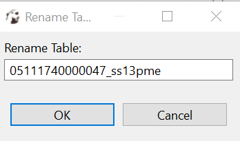

# Tugas 4 Big Data
Nama          : Anargya Widyadhana

NRP           : 05111740000047

Mata kuliah   : Big Data

## Daftar File

* KNIME workflow    : Ada di folder `2_Exercises` pada `1_DB` dan `2_Hadoop`
* File dataset  : Ada di folder `1_Data` pada `1_DB` dan `2_Hadoop`

---

## Exercises

### 1_DB

File data : `newCensus.sqlite`, berisi 2 tabel awal `ss13pme` dan `ss13hme`, berjumlah 30372 baris.

Pada exercise ini, diajarkan cara melakukan koneksi dan import DB, proses tabel, pengolahan data, dan penulisan ke DB. Dari data yang sudah ditunjukkan pada folder `1_Data`, data tersebut sudah merupakan hasil ubahan (hasil jadi dari proses pada exercise ini). Sehingga perlu dilakukan reset data dengan menjalankan workflow `01_regenerate ss13me tables` pada folder `1_Data`. Prosesnya seperti berikut.

Dari gambar tersebut, dilakukan reset dengan menghapus tabel di database sekarang dan membuat lagi dari file `.csv`. Hasil akhir akan terbentuk file `newCensus.sqlite`.

Setelah database direset, selanjutnya dilakukan perubahan pada nama kolom yang sudah ada. Perubahan dilakukan dengan aplikasi `DBeaver`.

#### 01_DB_Connect

Di sini, diperintahkan untuk mengkoneksi ke database SQLite `newCensus.sqlite` pada folder `1_Data`. Dan dipilih tabel `05111740000047_ss13pme` dan diimport ke KNIME data table. Sebagai opsional, membuat node `Credentials Configuration` dan dihubungkan ke `MySQL Connector` sebagai pengganti input username dan password manual.

Sesuai kriteria di atas dibuat workflow seperti berikut.

Pertama, dibuat connector database SQLite, dan dicari file `.sqlite` bernama `newCensus.sqlite` pada folder `1_DB`. Dan dihubungkan ke node `Table Selector` untuk memilih tabel `05111740000047_ss13pme`. Terakhir dihubungkan ke node `DB Reader` untuk mengimport database ke dalam bentuk KNIME data table.

Hasilnya seperti berikut.

Untuk opsional, dibuat 2 node yaitu `Credentials Configuration` dan `MySQL Connector`. Pada node `Credentials Configuration`, dimasukkan nama variabel, username dan password. Berikutnya pada node `MySQL Connector`, tinggal memilih opsi `Credentials` pada bagian `Authentication` dan dipilih sesuai nama variabel yang dibuat.

#### 02_DB_InDB_Processing

Hasil dari workflow sebagai berikut.

Di sini, akan dibuat 5 tabel sesuai kriteria yang berbeda yang di semua tabel akan dihapus kolom `PUMA*` dan `PWGTP*`. Tabel pertama akan dilakukan join `05111740000047_ss13pme` dan `05111740000047_ss13hme` menggunakan node `DB Joiner`. Hasilnya seperti berikut.

Tabel kedua akan berisi semua row `05111740000047_ss13pme` dengan nilai kolom `cow` adalah null. Dilakukan filter row dengan `DB Filter Row` dan didapatkan hasil berikut.

Tabel ketiga adalah kebalikan dari tabel kedua dimana nilai kolom `cow` tidak null. Didapatkan berikut.

Tabel keempat akan berisi rata-rata dari kolom `AGEP` dan dilakukan group by sesuai kolom `SEX`, dilakukan dengan node `DB GroupBy`. Konfigurasinya seperti berikut.

Dan hasilnya seperti berikut.

#### 03_DB_Modelling

Pada soal ini, dilakukan learning decision tree pada row yang nilai kolom `cow` tidak null dan prediksi value pada row yang nilai kolom `cow` null.

Gambaran workflownya seperti berikut.

Konfigurasi decision tree menggunakan `GINI Index` dan tanpa prune. Didapatkan hasil berikut.

#### 04_DB_WritingToDB

Pada soal ini diperintahkan untuk backup data `05111740000047_ss13pme` ke tabel `05111740000047_ss13pme_original`, dan membuat tabel berisi model hasil train dan timestamp, juga mengupdate row yang memiliki nilai `cow` null sesuai hasil prediksi decision tree.

Workflownya seperti berikut.

Untuk membackup tabel, sebelum memproses data, akan dibuat tabel dengan node `DB Connection Table Writer` dengan nama tabel `05111740000047_ss13pme_original`. Akan didapat hasil berikut.

Selanjutnya dibuat tabel baru berisi timestamp dan model hasil train. untuk timestamp didapatkan dengan node `timestamp & model`. Dan dihubungkan ke hasil model train, dan ke `DB Writer`. Didapatkan hasil berikut.

Terakhir, data hasil prediksi diupdate ke DB dengan node `DB Update`, dan node `Row Filter` untuk menangkap status update DB. Seperti berikut.

Sebelum update (dirutkan berdasarkan `cow`):

Setelah update (dirutkan berdasarkan `cow`):

Hasil status update (kosong artinya sukses):

### 2_Hadoop

Pada exercise ini akan dibuat koneksi ke Apache Hadoop dan database Apache Hive. 

#### 00_Setup_Hive_Table

Di sini dibuat environment untuk Big Data. Diload 2 tabel dari file .table `ss13hme.table` dan `ss13pme.table`. Tabel yang dibuat bernama `05111740000047_ss13hme`, dan `05111740000047_ss13pme`. Dan berikutnya akan dimasukkan ke Hive melalui Temp Directory yang akan dijadikan HDFS.

Di sini akan dijalankan sesuai contoh. Sesuai workflow berikut.

Menghasilkan:

#### 01_Hive_Modelling

Pada exercise ini, proses akan diganti sehingga database yang dipanggil adalah database Hive pada environment Big Data yang sudah terbuat. Sehingga yang perlu diganti adalah node connector awal dengan node `Create Local Big Data Environment`, seperti berikut.

Jika dijalankan:

Dan memiliki workflow:

#### 02_Hive_WritingToDB

Di sini proses yang sudah ada akan disimpan ke DB Hive, dengan cara membuat Temp Directory seperti proses awal, dan memanipulasi pathnya agar sesuai dengan HDFS, dibuat tabel baru dengan `DB Table Creator`, dan diakhiri dengan `DB Loader` untuk memasukkan data.

Workflow:

Hasil pembuatan tabel:

Hasil tabel baru:

Selesai.