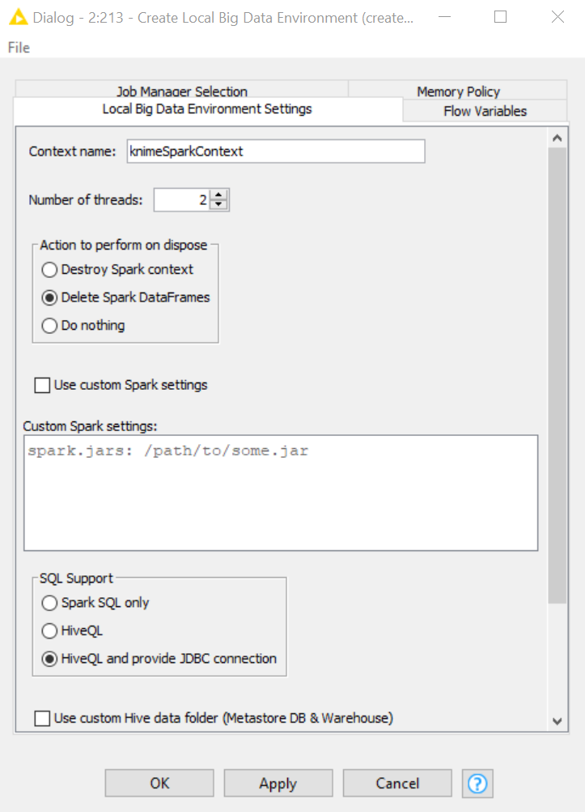
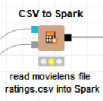

# Tugas Big Data - Implementasi Algoritma Rekomendasi

Nama          : Anargya Widyadhana

NRP           : 05111740000047

Mata kuliah   : Big Data

## Section
- [Pengerjaan Workflow](#pengerjaan-workflow)
  - [Daftar File](#daftar-file)
  - [Business Understanding](#business-understanding)
  - [Data Understanding](#data-understanding)
  - [Data Preparation](#data-preparation)
  - [Modeling](#modeling)
  - [Evaluation](#evaluation)
  - [Deployment](#deployment)
- [Perbandingan File Reader dan CSV to Spark](#perbandingan-file-reader-dan-csv-to-spark)

## Pengerjaan Workflow
Workflow yang akan dikerjakan adalah workflow Movie Recommendation Engine menggunakan Apache Spark (KNIME). Hasil akhir workflow akan seperti berikut.

### Daftar File

* KNIME workflow    : `10_Recommendation_Engine_w_Spark_Collaborative_Filtering (migrated).knwf`
* File dataset  : Digunakan `movies.csv` dan `ratings.csv` (dataset tidak diupload karena melebihi batas ukuran maksimum file Github)
* Deskripsi dataset : Data ini diperoleh  oleh GroupLens Research dari website [MovieLens](http://movielens.org)
* Sumber dataset    : https://grouplens.org/datasets/movielens/, MovieLens 20M Dataset (ml-20m.zip)

---

### Business Understanding

Kali ini, akan diimplementasikan salah satu algoritma rekomendasi untuk memberikan rekomendasi film mana saja yang mungkin saja disukai oleh seorang user, berdasarkan hasil rating yang user itu berikan pada beberapa film sebelumnya. Algoritma yang digunakan yaitu `Collaborative Filtering (CF)` dengan teknik `Alternating Least Squares (ALS)`. Algoritma Collaborative Filtering didasarkan pada asumsi bahwa jika seorang user A mempunyai pendapat yang sama dengan user B dalam sebuah kasus, maka A lebih berkemungkinan juga memiliki pendapat yang sama dengan B pada kasus yang lain daripada terhadap user acak yang lain.

Selain itu, algoritma ini juga sudah diimplementasikan pada `Spark MLlib` dengan tujuan melakukan eksekusi yang cepat pada data yang besar. Dan Spark sendiri juga sudah tersedia di `KNIME Analytics Platform` pada ekstensi `Big Data Extensions`.

### Data Understanding

* Jumlah file: 6
* Format data:
    
    Semua data berupa file `.csv`, masing-masing kolomnya dipisahkan tanda koma (`,`).

* Jumlah data:
    - `genome-scores.csv` : +- 13.000.000
    - `genome-tags.csv` : +- 1.000
    - `links.csv` : +- 27.000
    - `movies.csv` : +- 27.000
    - `ratings.csv` : +- 20.000.000
    - `tags.csv` : +- 465.000

    Data yang akan digunakan adalah pada file `movies.csv` dan `ratings.csv`
* Makna kolom:
    - Pada `movies.csv`:
        1. movieId: identifier unik pada setiap film
        2. title: judul film
        3. genres: genre film

    - Pada `ratings.csv`:
        1. userId: id user yang memberikan rating
        2. movieId: id film yang diberi rating, adalah foreign key dari tabel pada file `movies.csv`
        3. rating: rating yang diberikan oleh user tersebut dengan 5-skala (0 - 5)
        4. timestamp: total detik sejak midnight Coordinated Universal Time (UTC) pada January 1, 1970

### Data Preparation

Dalam melakukan rekomendasi menggunakan algoritma CF-ALS, training model dilakukan melalui `Spark Collaborative Filtering Learner` node. Node ini dieksekusi di dalam konteks Spark, yang artinya kita akan butuh Big Data Environment variable menggunakan node `Create Local Big Data Environment` seperti pada gambar di bawah.

Data yang akan kita lakukan train dan predict berasal dari `ratings.csv`. Maka setelah membuat Big Data Environment, file `ratings.csv` akan diload ke Spark melalui node `CSV to Spark`.

Dan berikutnya data tersebut akan dipartisi, dimana 80% nya secara acak akan dijadikan set training, sedangkan 20% sisanya digunakan dalam testing. Testing di sini digunakan dalam tahap evaluasi untuk mengukur MSE dan rMSE (bukan dalam prediksi rekomendasi film user).

Ide dari algoritma ALS adalah mencari user lain dari training set dengan kriteria yang mirip dengan user yang dipilih saat ini. Rekomendasi akan diambil dari user yg dipilih berdasarkan profile/preferensi yang sama atau mirip pada masing-masing user.

Oleh karena itu, dibutuhkan sejumlah data dari user yang dipilih sebelum bisa merekomendasikan data padanya. Hal ini dilakukan dengan pada awalnya meminta user yang dipilih untuk mengisi rating dari 20 film acak dari daftar film pada `movies.csv`. Pada workflow ini, rating adalah antara 0 dan 5 (0 buruk dan 5 sangat baik). User bisa menginput -1 jika film tersebut belum pernah ditontonnya, dan jika demikian maka rating yang dilakukan user terhadap film tersebut tidak diikutkan ke dalam proses training, sementara yang berisi angka lain akan berikutnya berlanjut ke proses training. Sementara sisa filmnya (film selain 20 film pada proses di atas), akan nantinya dilakukan testing berdasarkan model training yang sudah ditrain.

Maka pertama akan diload dataset semua film dengan node `File Reader` pada `movies.csv`. Tidak digunakan `CSV to Spark` seperti di atas karena kita ingin memodifikasi data ini terlebih dahulu.

Berikutnya akan dilakukan beberapa proses, yaitu menambah kolom `userId`, dalam percobaan ini userId nya adalah `999999`, dan `timestamp = 123`. Penambahan kolom ini digunakan untuk menandai user baru yang sedang diuji coba.

Dan berikutnya dilakukan pengambilan baris sebanyak 20 baris secara acak sebagai acuan data dari user tersebut.

Dari hasil di atas, 20 baris yang diambil akan masuk ke node untuk meminta user mengisi rating pada 20 film tersebut. Pada kali ini akan digunakan node `Text Output` dan node `Table Editor (JavaScript)` yang diwrap ke dalam metanode yang dieksekusi oleh `KNIME WebPortal`. Rating bisa dimasukkan pada kolom paling kanan

Berikutnya setelah klik `Apply`, dari sini data akan dimasukkan ke Spark dengan node `Table to Spark`.

Semua proses di atas jika digabungkan seperti berikut.

### Modeling

Pada proses ini, 80% data rating dari `ratings.csv` ditambah 20 data rating dari user baru di atas, akan dilakukan training algoritma CF-ALS dengan node `Spark Collaborative Filtering Learner`. Jadi sebelum itu, akan digabungkan dulu 80% data rating dan 20 data rating dari user baru tersebut dengan node `Spark Concatenate`.

Setelah itu, langsung dilakukan training dengan node `Spark Collaborative Filtering Learner`.

Workflow Modeling keseluruhan sebagai berikut.

### Evaluation

Setelah ditrain berikutnya akan dilakukan dua proses, yaitu mengetes scoring error dan melakukan rekomendasi kepada user yang dipilih. Proses evaluation di sini mencakup scoring error.

Sebelumnya, data sebelum ditrain, data dari `ratings.csv` dipartisi menjadi 80:20 untuk train:predict, lalu model hasil predict akan dihubungkan ke node `Spark Predictor` bersamaan dengan 20% data yang digunakan untuk testing.

Berikutnya datanya akan dibersihkan dari data berisi `NaN` jika terdapat tersebut, dengan node `Spark Missing Value`, dan lalu akan dilakukan scoring antara kolom `rating` (kolom yang sudah ada dari csv) dan `prediction` (kolom hasil prediksi), dan akan didapatkan data-data akurasinya. Hal ini dilakukan melalui node `Spark Numeric Scorer`.

Workflow Evaluation keseluruhan sebagai berikut.

### Deployment

Deployment di sini dilakukan terhadap sisa data film selain 20 film yang dirating user di proses awal tadi. Sama seperti evaluation, pertama akan dilakukan prediction pada semua sisa data film user, lalu akan diconvert dari Spark dan dimasukkan ke tabel KNIME menggunakan node `Spark to Table`.

Dan akan diambil 10 rekomendasi terbaik. Di sini digunakan metanode, yang apabila dibuka terdiri dari beberapa rangkaian proses yang diconvert menjadi satu metanode, sebagai berikut.

Berikutnya, hasilnya akan ditampilkan lagi ke tampilan website melalui `KNIME WebPortal` untuk menampilkan judul film dan genrenya.

Jika dilihat, keseluruhan proses Deployment adalah berikut.

## Perbandingan File Reader dan CSV to Spark

Pada kali ini, akan dilakukan perbandingan antara node `File Reader` (node untuk membaca data dari file secara umum, bisa digunakan dalam KNIME, dan akan diconvert ke tipe `KNIME Table`), dan node `CSV to Spark` (node bagian dari `Big Data Extension` yang digunakan untuk membaca file CSV dan dimasukkan ke dalam Spark).

Perbandingan ini menurut saya masih belum sesuai, karena data yang dihasilkan antara kedua node tersebut berbeda. Hasil dari `File Reader` tidak langsung masuk ke Spark, oleh karena itu di sini saya akan menambahkan satu node lagi setelah `File Reader`, yaitu node `Table to Spark` agar perbandingan yang dilakukan benar-benar sesuai. Jika dirangkai, rangkaian workflow untuk perbandingannya sebagai berikut.

Pertama, kita akan mencoba untuk data berukuran besar, yaitu `ratings.csv` yang berisi sekitar 20 juta data. Pada percobaan dengan node `CSV to Spark`, dihasilkan hasil berikut. (Alat hitung waktu yang digunakan adalah Stopwatch komputer).

Hasilnya adalah sekitar **45 detik**.

Sementara jika menggunakan `File Reader`, hasilnya sebagai berikut.

Dapat dilihat bahwa bahkan prosesnya gagal. Saya sudah mencobanya 2 kali, dan pada saat proses di node `File Reader` sendiri membutuhkan waktu **3 menit** (waktu di sebelah kanan pada gambar di atas), sedangkan pada proses `Table to Spark` sendiri pada awalnya lancar, hingga pada saat progres berada pada 50%, tiba-tiba KNIME menjadi not responding beberapa kali, dan setelah kurang lebih 15-18 menit, muncul tanda error pada node tersebut (`java heap space: out of memory`). Sehingga untuk data `ratings.csv`, penggunaan `File Reader` tidak berhasil.

Sementara untuk data yang lebih kecil, seperti `movies.csv`, yang hanya berisi 20 ribu data, semua proses pada semua node berjalan lancar. Yang menarik di sini adalah, bahwa `CSV to Spark` memakan waktu lebih lama daripada `File Reader` walaupun selisihnya hanya beberapa detik saja.

### Kesimpulan

Kesimpulan dari perbandingan ini adalah, untuk **data berukuran besar** (sampai jutaan), penggunaan `CSV to Spark` **sangat direkomendasikan** dan bahkan waktu dari node ini sendiri lebih cepat daripada node `File Reader` saja (yang bahkan belum termasuk node `Table to Spark` untuk mengubahnya ke konteks Spark).

Dan untuk data yang lebih kecil (hanya ribuan atau puluhan ribu), penggunaan `File Reader` bisa dikatakan sebanding dengan `CSV to Spark` (hanya lebih cepat beberapa detik saja).

Jadi kesimpulannya, jika ingin meload data ke konteks Spark, `CSV to Spark` **lebih direkomendasikan** daripada `File Reader`, karena selain lebih efektif (hanya perlu satu node), ini juga lebih cepat untuk data yang besar, bisa jadi dikarenakan node ini terhubung dengan `HDFS Connection` dan `Spark Context`, yang memang sudah dirancang untuk Big Data, dan proses yang dilakukan dijalankan dengan Thread.
