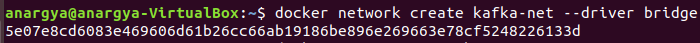
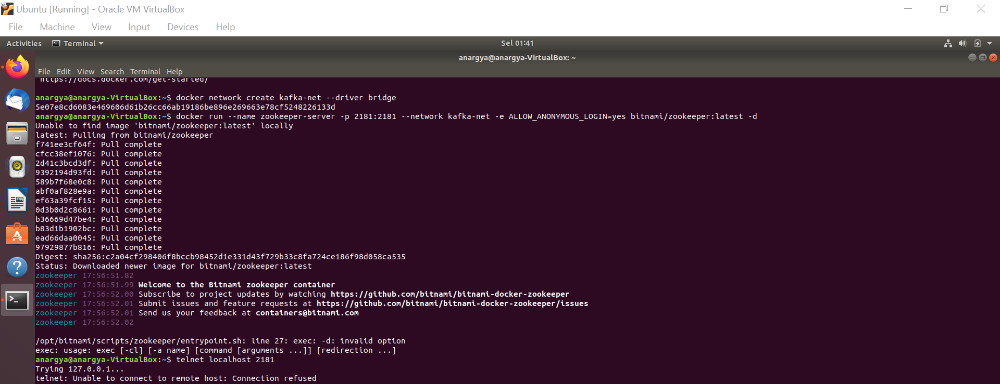
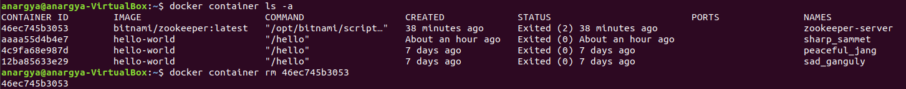
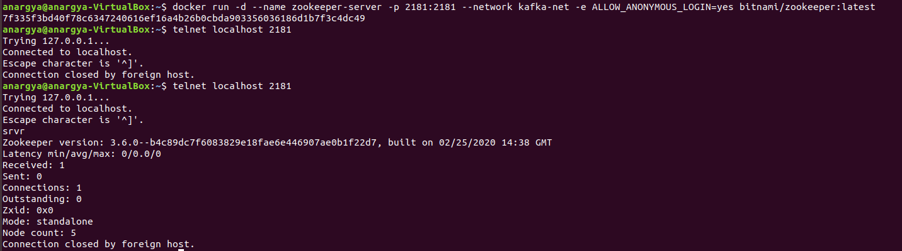
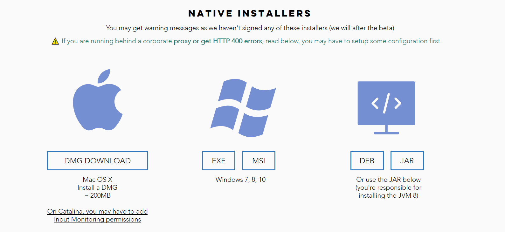
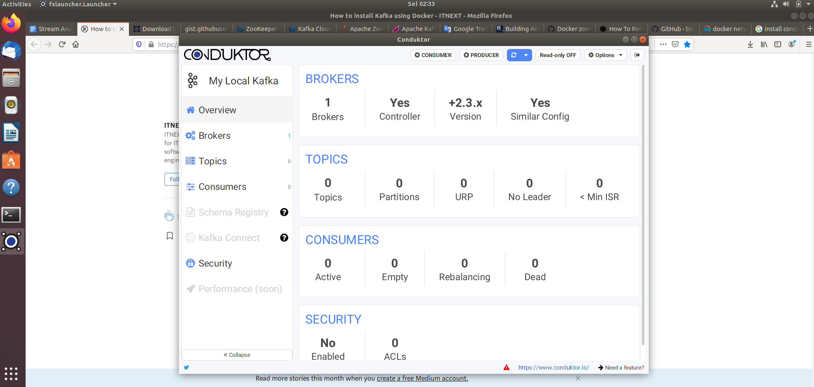
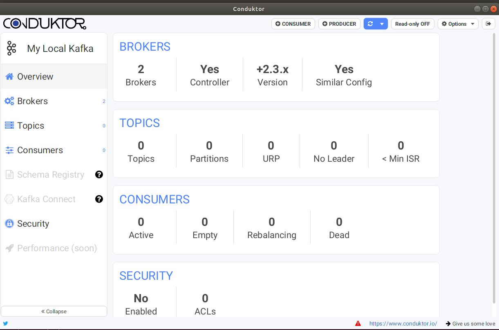

# Tugas Big Data - Implementasi Infrastruktur Kafka

Nama          : Anargya Widyadhana

NRP           : 05111740000047

Mata kuliah   : Big Data

## Instalasi Docker

Di sini, saya menggunakan Oracle VM Virtualbox dengan guest OS Ubuntu 18.04. Pertama-tama dilakukan instalasi docker di Ubuntu sesuai dengan instalasi pada link yang terkait.

Link: [Install Docker Engine on Ubuntu](https://docs.docker.com/engine/install/ubuntu/)

1. Jalankan command berikut

    ```bash
    $ sudo apt-get update

    $ sudo apt-get install \
        apt-transport-https \
        ca-certificates \
        curl \
        gnupg-agent \
        software-properties-common
    ```

2. Tambah Docker official GPG key:
    ```bash
    $ curl -fsSL https://download.docker.com/linux/ubuntu/gpg | sudo apt-key add -
    ```

    Jalankan `$ sudo apt-key fingerprint 0EBFCD88` untuk mengecek keynya, pastikan keynya adalah `9DC8 5822 9FC7 DD38 854A  E2D8 8D81 803C 0EBF CD88`.

3. Sesuai dengan arsitektur OS kalian pilih repositorynya (untuk Ubuntu 18.04 adalah `x86_64` / `amd64`). Dan lakukan command berikut untuk memilih repository docker yang stable.
    ```bash
    $ sudo add-apt-repository \
        "deb [arch=amd64] https://download.docker.com/linux/ubuntu \
        $(lsb_release -cs) \
        stable"
    ```

4. Install Docker Engine dengan command berikut.
    ```bash
     $ sudo apt-get update
     $ sudo apt-get install docker-ce docker-ce-cli containerd.io
    ```

5. Untuk memverifikasi instalasi, jalankan command berikut sebagai testing menjalankan container.
    ```bash
     $ sudo docker run hello-world
    ```

Sampai di sini, docker berhasil diinstall namun agar tidak perlu mengetik `sudo` setiap kali menjalankan docker, bisa dibuat Unix group yang bernama `docker` dan ditambahkan user ke dalamnya. Caranya seperti berikut.

1. Buat `docker` group
    ```bash
    $ sudo groupadd docker
    ```

2. Tambahkan user ke grup `docker` yang baru dibuat
    ```bash
    $ sudo usermod -aG docker $USER
    ```

3. Log out dan login lagi. Jika menggunakan VM seperti saya, diperlukan restart.


## Instalasi Kafka pada Docker

Saat akan instalasi Kafka, salah satu hal yang perlu diinstall sebelumnya adalah [Apache Zookeeper](https://zookeeper.apache.org/). Ini karena nantinya, Kafka akan menyimpan informasi clusternya dan consumer maupun producer pada Apache Zookeeper ini. Jadi Apache Zookeeper bertindak sebagai koordinator pada Kafka.

Untuk instalasinya sebagai berikut.

1. Buat docker network untuk container kita. Di sini dengan nama `kafka-net`.

    ```bash
    $ docker network create kafka-net --driver bridge
    ```

    

2. Lalu jalankan container Zookeeper dari image Bitname Zookeeper:
    ```bash
    $ docker run --name zookeeper-server -p 2181:2181 --network kafka-net -e ALLOW_ANONYMOUS_LOGIN=yes bitnami/zookeeper:latest -d 
    ```

    Di sini akan muncul error berikut, karena opsi `-d` tidak bisa terbaca. Sehingga tidak bisa dilakukan `telnet` untuk tes koneksi.

    

    Dalam hal ini kita harus mengulang menjalankan container. Hapus container yang sudah ada tadi.
    ```bash
    $ docker container rm [CONTAINER ID]
    ```

    Container ID dapat didapatkan melalui command:
    ```bash
    $ docker container ls -a
    ```

    

    Berikutnya solusi dari error tadi adalah, pindah opsi `-d` berada di depan `--name`, menjadi seperti berikut.

    ```bash
    $ docker run -d --name zookeeper-server -p 2181:2181 --network kafka-net -e ALLOW_ANONYMOUS_LOGIN=yes bitnami/zookeeper:latest
    ```

    

    Lakukan testing dengan:
    ```bash
    $ telnet localhost 2181
    ```

    dan ketik `srvr` untuk melihat server Zookeeper yang berjalan.

3. Karena Zookeeper sudah berhasil berjalan dan terinstall, kita langsung bisa menambah server/broker Kafka dengan command berikut. Isikan `--name` dengan nama server bebas, `--network` sesuai nama network yang dibuat sebelumnya, `KAFKA_CFG_ZOOKEEPER_CONNECT` sesuai nama container Zookeeper dan port yang diinstall, dan `KAFKA_CFG_ADVERTISED_LISTENERS` sesuai port tempat server ini agar nanti Zookeeper dapat mempublish IP dan port ini ke client.

    ```bash
    $ docker run -d --name kafka-server1 --network kafka-net -e ALLOW_PLAINTEXT_LISTENER=yes -e KAFKA_CFG_ZOOKEEPER_CONNECT=zookeeper-server:2181 -e KAFKA_CFG_ADVERTISED_LISTENERS=PLAINTEXT://localhost:9092 -p 9092:9092 bitnami/kafka:latest
    ```

4. Lakukan instalasi [Conduktor](https://conduktor.io) yang berfungsi sebagai Kafka Desktop Client, sebagai program UI dari Kafka. Lakukan instalasi seperti biasa.

    

5. Berikutnya, buka Conduktor yang sudah diinstall, dan akan dihasilkan tampilan berikut.

    

    Terlihat bahwa terdapat 1 broker yaitu `kafka-server1` yang telah dibuat tadi. Jika ingin menambah broker, bisa menggunakan cara yang sama. Pastikan nama dan port yang digunakan berbeda dari yang tadi. Misal dibuat broker baru dengan nama `kafka-server2`:

    ```bash
    $ docker run -d --name kafka-server2 --network kafka-net -e ALLOW_PLAINTEXT_LISTENER=yes -e KAFKA_CFG_ZOOKEEPER_CONNECT=zookeeper-server:2181 -e KAFKA_CFG_ADVERTISED_LISTENERS=PLAINTEXT://localhost:9093 -p 9093:9092 bitnami/kafka:latest
    ```

    Lihat hasilnya di Conduktor

    

Infrastruktur Kafka berhasil diinstall.