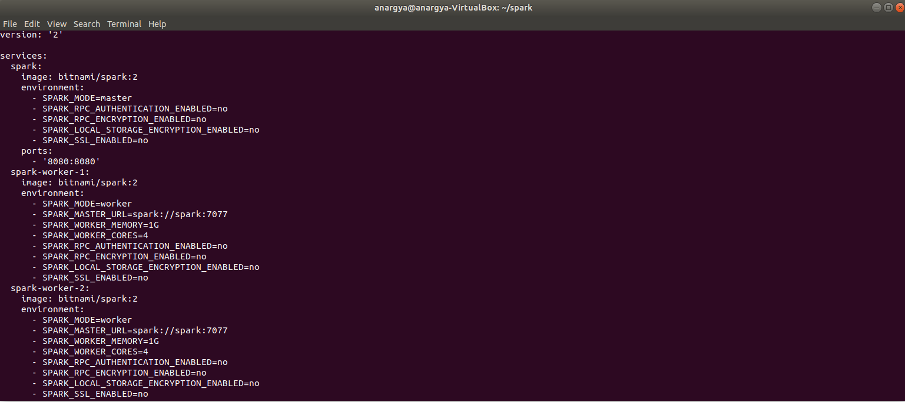

# Tugas Big Data - Menjalankan Python pada Apache Spark

Nama          : Anargya Widyadhana

NRP           : 05111740000047

Mata kuliah   : Big Data

## Section
- [Spesifikasi Komputer](#spesifikasi-komputer)
- [2 Worker, 2 Core](#2-worker-2-core)
- [2 Worker, 4 Core](#2-worker-4-core)
- [5 Worker, 2 Core](#5-worker-2-core)
- [5 Worker, 4 Core](#5-worker-4-core)
- [Kesimpulan](#kesimpulan)

## Spesifikasi Komputer

Pada pengerjaan kali ini, saya menggunakan Virtual Machine dengan Virtualbox, dengan spesifikasi sebagai berikut.

- Versi Virtualbox: 6.1.4
- Sistem Operasi: Ubuntu 18.04
- Jumlah Prosesor: 4
- Memori: 4096 MB

## 2 Worker, 2 Core

Pertama, dicoba konfigurasi pada `2 worker` dengan masing-masing worker dengan `2 core`. Pada file docker-compose, akan dibuat 2 worker dengan nama `spark-worker-1` dan `spark-worker-2`. Untuk mengganti core, pada bagian `SPARK_WORKER_CORES` akan ditulis sejumlah core yang kita inginkan, dan pada `SPARK_WORKER_MEMORY` bisa ditulis jumlah memori yang diinginkan pada masing-masing worker. Seperti berikut.

Lalu dijalankan dengan command `docker-compose up` pada direktori yang sama dengan file docker compose, dan jika dibuka `localhost:8080` akan muncul halaman Apache Spark seperti berikut.

Terlihat bahwa 2 worker telah dibuat dengan spesifikasi yang sama seperti yang didefinisikan. Berikutnya bisa masuk ke bash pada Apache Spark dengan command `exec -it <container id> /bin/bash`. Dan bisa menjalankan script python contoh yang sudah tersedia (untuk contoh ini menghitung estimasi nilai PI). Dalam menjalankannya, bisa dituliskan berapa jumlah job yang ingin dibuat untuk dibagi ke masing-masing worker. Kita akan membuat 2 contoh, untuk `100 job` dan untuk `1000 job`.

1. 100 Job
Untuk 100 job, hasil waktu yang diberikan seperti berikut.

    

    Terlihat bahwa waktu yang dibutuhkan mulai dari map-reduce sampai menampilkan hasil ke layar dan menutup proses adalah <b>39 detik</b>

2. 1000 Job
Untuk 1000 job, hasil waktu yang diberikan seperti berikut.

    

    Waktu yang dibutuhkan adalah <b>3,1 menit</b>

## 2 Worker, 4 Core

Untuk `2 worker` dan `4 core` tinggal mengganti di file docker compose seperti berikut.

Dan jika dijalankan dengan `docker-compose up` akan memberikan hasil berikut.

Berikutnya, jika file Python sama seperti tadi dijalankan, hasilnya seperti berikut.

1. 100 Job

    

    Waktu yang dibutuhkan adalah <b>35 detik</b>

2. 1000 Job

    

    Waktu yang dibutuhkan adalah <b>3,3 menit</b>

## 5 Worker, 2 Core

Untuk `5 worker` dan `2 core` tinggal mengganti di file docker compose seperti berikut.

Dan jika dijalankan dengan `docker-compose up` akan memberikan hasil berikut.

Berikutnya, jika file Python sama seperti tadi dijalankan, hasilnya seperti berikut.

1. 100 Job

    

    Waktu yang dibutuhkan adalah <b>2,6 menit</b>

2. 1000 Job

    

    Waktu yang dibutuhkan adalah <b>4,3 menit</b>

## 5 Worker, 4 Core

Untuk `5 worker` dan `4 core` tinggal mengganti di file docker compose seperti berikut.

Dan jika dijalankan dengan `docker-compose up` akan memberikan hasil berikut.

Berikutnya, jika file Python sama seperti tadi dijalankan, hasilnya seperti berikut.

1. 100 Job

    

    Waktu yang dibutuhkan adalah <b>4,7 menit</b>

2. 1000 Job

    

    Waktu yang dibutuhkan adalah <b>5,7 menit</b>

## Kesimpulan

Jika semua waktu tadi digabung, didapatkan hasil berikut.

Dari tabel tersebut dapat dilihat bahwa dalam jumlah core sama, dengan job berbeda akan memberi waktu yang cukup terlihat. Semakin banyak job yang diberikan, maka waktu semakin lama. Hal ini karena overhead pada proses map-reduce jika job yang diberikan terlalu banyak.

Sementara anehnya, pada penambahan core, ternyata butuh waktu yang lebih lama juga. Semakin tinggi jumlah worker, selisih waktu antar core juga semakin tinggi pula. Sehingga jika jumlah core ditambah, untuk proses penjalanan script Python ini menjadi semakin lama.

Sedangkan jika penambahan worker dilakukan, juga menyebabkan proses lebih lama. Hal ini menurut saya cukup jelas, karena semakin banyak worker, maka proses map-reduce juga akan lebih banyak terjadi, apalagi untuk menjalankan script yang kecil seperti ini, akan terlalu banyak overhead pada map-reduce dibanding lama eksekusi script Python itu sendiri. Selain itu, dalam pengoperasian jumlah worker yang banyak, artinya akan memakan resource komputer yang semakin banyak juga. Selama pengoperasian dengan 5 worker ini, sempat beberapa kali komputer mengalami not responding, sehingga VM harus beberapa kali direstart.

Tentunya, kesimpulan yang diambil tadi bisa jadi berbeda untuk kasus yang berbeda. Beberapa proses yang memerlukan komputasi besar bisa jadi lebih efektif jika dikerjakan dengan banyak job, core dan worker, karena pekerjaan bisa dilakukan secara paralel. Tetapi untuk script Python ini, terlalu overhead untuk worker, core, dan job yang banyak.