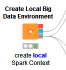

# Tugas Big Data - Implementasi Algoritma Rekomendasi

Nama          : Anargya Widyadhana

NRP           : 05111740000047

Mata kuliah   : Big Data

## Section

Ada 2 section, untuk workflow `MLlib Model to PMML` dan `Spark Compiled Model Predictor`

- [Daftar File](#daftar-file)
- [1 Llib Model to PMML](#1-mllib-model-to-pmml)
  - [1.1 Business Understanding](#1.1-business-understanding)
  - [1.2 Data Understanding](#1.2-data-understanding)
  - [1.3 Data Preparation](#1.3-data-preparation)
  - [1.4 Modeling](#1.4-modeling)
  - [1.5 Evaluation](#1.5-evaluation)
  - [1.6 Deployment](#1.6-deployment)
- [2 Spark Compiled Model Predictor](#2-spark-compiled-model-predictor)
  - [2.1 Business Understanding](#2.1-business-understanding)
  - [2.2 Data Understanding](#2.2-data-understanding)
  - [2.3 Data Preparation](#2.3-data-preparation)
  - [2.4 Modeling](#2.4-modeling)
  - [2.5 Evaluation](#2.5-evaluation)
  - [2.6 Deployment](#2.6-deployment)
- [Kesimpulan](#kesimpulan)

## Daftar File

* KNIME workflow    : `Mass_Learning_Event_Prediction_MLlib_to_PMML.knwf`
* File dataset  : Digunakan `knime://knime.workflow/data.trn` dan `knime://knime.workflow/data.tst`
* Deskripsi dataset : Merupakan data klasifikasi bunga menurut panjang dan lebar kelopak bunga dan mahkota bunga
* Sumber dataset    : Tersedia dari aplikasi KNIME Analytics Platform

---

## 1 Mllib Model to PMML

Dalam workflow ini, akan dijelaskan mengenai penggunaan node `Mllib Model to PMML`. Node ini berguna untuk mengubah model hasil train dari Spark ke format PMML yang lebih general, sehingga nanti bisa dicompile menggunakan bahasa lain dan diprediksi dengan hasil yang sama. Bersamaan dengan node Compiler Predictor dan node JSON input/output akan membuat model yang disebut arsitektur lambda yang melakukan train secara offline dengan data yang ada, dan melakukan prediksi secara online dengan model yang sudah ditrain.

### 1.1 Business Understanding

Kali ini, akan digunakan proses klustering data dengan Apache Spark, menggunakan node `Spark k-Means`. Oleh karena itu, pertama akan dibuat konteks Apache Spark, memasukkan data ke dalam tabel Spark, dan melakukan klustering data dengan algoritma k-Means. Berikutnya, model Spark hasil train akan diconvert ke format PMML dengan node `Mllib Model to PMML`. Dan hasil model format PMML bisa dicompile dengan bahasa pemrograman lain, di sini dengan node `PMML Compiler`. Lalu hasil compile bisa dipredict dengan model `Compiled Model Predictor`.

Prediksi data akan dilakukan dalam 2 tahap, dengan file batch dan dengan single data dalam bentuk JSON. Dalam data batch dari file untuk testing akan dicari skor entropynya, sedangkan dari single data JSON akan dicari prediksi klusternya dan direturn dalam format JSON juga.

### 1.2 Data Understanding

* Jumlah data: 75
* Makna kolom:
    1. sepal length: panjang kelopak bunga
    2. sepal width: lebar kelopak bunga
    3. petal length: panjang mahkota bunga
    4. petal width: lebar mahkota bunga
    5. class: nama spesies bunga

### 1.3 Data Preparation

Dalam melakukan algoritma k-Means untuk klustering data, dalam konteks Spark, training model dilakukan melalui `Spark k-Means` node. Node ini dieksekusi di dalam konteks Spark, yang artinya kita akan butuh Big Data Environment variable menggunakan node `Create Local Big Data Environment` seperti pada gambar di bawah.

Data yang akan kita lakukan train dan predict berasal dari `knime://knime.workflow/data.trn`. Maka setelah membuat Big Data Environment, file `knime://knime.workflow/data.trn` akan diload ke Spark melalui node `File Reader` dan `Table to Spark`.

Semua proses di atas jika digabungkan seperti berikut.

### 1.4 Modeling

Pada proses ini, akan dilakukan training dengan metode clustering menggunakan algoritma k-means di dalam konteks Spark, menggunakan node `Spark k-Means`. Akan digunakan 3 cluster (sesuai dengan jumlah kelas pada data) dan 30 kali iterasi. Semua kolom selain `class` akan digunakan dalam training model.

Terlihat bahwa node `Spark k-Means` mempunyai 2 output, salah satunya dalam bentuk `Spark DataFrame` (gambar kedua dari bawah), yang berisi hasil train beserta kolom `Cluster`, hasil pembagian cluster dari algoritma k-Means. Terlihat juga bahwa untuk kelas `Iris-setosa` dan `Iris-versicolor`, semua data training mempunyai cluster `1` dan `2`, semua sesuai dengan hasil pada data awal. Sementara untuk kelas `Iris-virginica`, hasil cluster beberapa adalah cluster `0`, beberapa cluster `2`.

Output dari node k-means yang lain adalah dalam bentuk `Spark Model` (gambar paling bawah). Agar Spark model tersebut dapat dicompile dari manapun, maka akan diconvert ke dalam bentuk model yang lebih umum, yaitu `PMML Model`. Dalam KNIME, hal tersebut dilakukan dengan memanfaatkan node `Spark MLlib to PMML`.

Setelah diconvert, output dari node `Spark MLlib to PMML` adalah `PMML Model`. Model ini lalu bisa dicompile di dalam KNIME dengan node `PMML Compiler`. Dalam kenyataannya, model PMML bisa dicompile menggunakan berbagai bahasa pemrograman, seperti Python dan Java.

Workflow Modeling keseluruhan sebagai berikut.

### 1.5 Evaluation

Setelah ditrain berikutnya akan dilakukan dua proses, yaitu melakukan prediksi terhadap data testing dan menghitung skor entropy

Pertama akan dilakukan prediksi menggunakan data testing. Data testing akan diload ke dalam bentuk tabel menggunakan node `File Reader` dari file `knime://knime.workflow/data.tst`.

Selanjutnya, data tabel secara general bisa langsung dipredict dengan node `Compiled Model Predictor`, yang dihubungkan dengan `PMML Model` dari proses sebelumnya.

Lalu, bisa dilakukan skoring dengan metode skor entropy, menggunakan node `Entropy Scorer`.

Pada hasil entropy scorer, terlihat bahwa untuk cluster `1` dan `2` mempunyai `nilai entropy 0`. Artinya tidak ada uncertainty pada data testing tersebut atau bisa dikatakan untuk prediksi pada cluster `1` dan `2` akurat 100%. Sementara pada cluster `0` memiliki `nilai entropy 0.778`.

Workflow Evaluation keseluruhan sebagai berikut.

### 1.6 Deployment

Deployment di sini dilakukan dengan cara memprediksi data dari format JSON. JSON adalah format pengiriman data yang banyak digunakan dalam aplikasi web, umumnya ketika mengakses suatu API.

Pertama data dari JSON akan diubah menjadi bentuk tabel. Dalam contoh pembuatan JSON, di sini menggunakan node `Container Input (JSON)`.

Kemudian data diubah ke dalam bentuk tabel dengan node `JSON to Table`.

Selanjutnya dilakukan prediksi dengan cara yang sama menggunakan node `Compiled Model Predictor`. Dan data diubah kembali untuk direturn dalam bentuk JSON dengan node `Table to JSON` dan `Container Output (JSON)`

Jika dilihat, keseluruhan proses Deployment adalah berikut.

---

## 2 Spark Compiled Model Predictor

Dalam workflow ini, akan dijelaskan mengenai penggunaan node `Spark Compiled Model Predictor` yang akan melakukan convert dari data `PMML Model` ke kode mesin dan menggunakan model yang dikompilasi untuk memprediksi sejumlah besar data secara paralel dalam Apache Spark.

### 2.1 Business Understanding

Kali ini, akan digunakan proses gabungan antara algoritma `Decision Tree` dan `Neural Network`. Hasil dari model akan digabung dan diconvert ke `PMML Model`. Selanjutnya, akan dilakukan prediksi dengan node `Spark Compiled Model Predictor` dan akan dilakukan scoring terhadapnya.

### 2.2 Data Understanding

Data untuk training dan testing sama dengan data sebelumnya.

* Jumlah data: 75
* Makna kolom:
    1. sepal length: panjang kelopak bunga
    2. sepal width: lebar kelopak bunga
    3. petal length: panjang mahkota bunga
    4. petal width: lebar mahkota bunga
    5. class: nama spesies bunga

### 2.3 Data Preparation

Data yang akan kita lakukan predict berasal dari `knime://knime.workflow/data.tst`. Karena pada proses prediction akan menggunakan konteks Spark, maka data testing akan diload ke Spark, Pertama dibutuhkan membuat Big Data Environment, dan selanjutnya file `knime://knime.workflow/data.tst` akan diload ke Spark melalui node `File Reader` dan `Table to Spark`.

Karena data untuk training akan diproses tidak dalam konteks Spark, maka akan diload dengan `File Reader` biasa.

Semua proses di atas jika digabungkan seperti berikut.

### 2.4 Modeling

Pada proses ini, akan dilakukan training dengan algoritma Decision Tree dan Neural Network. Untuk Regression Tree menggunakan node `Decision Tree Learner` dan untuk Neural Network menggunakan `RProp MLP Learner`.

    - Decision Tree Learner

    

    

    - RProp MLP Learner

    

    

Data output dari kedua learner node tersebut adalah dalam bentuk `PMML Model`. Agar bisa digabungkan, maka diconvert dulu ke dalam cell oleh node `PMML to Cell`.

Lalu digabung dengan node `Concatenate`

Lalu dikembalikan lagi ke dalam bentuk `PMML Model` dengan node `Table to PMML Ensemble`.

Setelah diconvert, output dari node `Table to PMML Ensemble` adalah `PMML Model`. Model ini lalu bisa dicompile di dalam KNIME dengan node `PMML Compiler`. Dalam kenyataannya, model PMML bisa dicompile menggunakan berbagai bahasa pemrograman, seperti Python dan Java.

Workflow Modeling keseluruhan sebagai berikut.

### 2.5 Evaluation

Setelah ditrain berikutnya akan dilakukan dua proses, yaitu melakukan prediksi terhadap data testing dan menghitung skor

Di sini akan digunakan node `Spark Compiled Model Predictor`. Input dari node ini adalah model PMML dan Spark DataFrame yang berasal dari data testing yang diload ke Spark tadi.

Selanjutnya data akan diubah menjadi bentuk tabel dengan node `Spark to Table`.

Lalu, bisa dilakukan skoring, menggunakan node `Scorer`.

Didapatkan hasil skor akurasi `96%` dan error `4%` dan data yang salah sebanyak `3`. melalui percobaan dengan algoritma ini.

Workflow Evaluation keseluruhan sebagai berikut.

### 2.6 Deployment

Untuk workflow yang kedua ini, tidak ada deployment dalam implementasinya. Namun, keseluruhan proses tadi juga merupakan praktek testing dari deployment ini.

## Kesimpulan

Pada workflow pertama, menggunakan konteks Spark ketika train model membuat proses train menjadi lebih efektif, karena proses train yang biasanya lama bisa dimodel dengan Apache Spark sehingga berjalan paralel. Sementara hasil train bisa diconvert ke PMML model untuk dicompile dengan banyak bahasa pemrograman lain sehingga lebih portable. Sementara untuk algoritmanya sendiri, dengan data training dan data testing yang sama, dengan k-Means **lebih kurang akurat** dibanding algoritma pada workflow kedua menggunakan gabungan Decision Tree dan Neural Network. Dari hasil percobaan, pada workflow 1 dengan k-Means terdapat kesalahan 8 data dari 74 data, sedangkan pada workflow 2 ada kesalahan 3 data saja dari 74 data.

Sementara pada workflow kedua, implementasi Spark saat melakukan prediction juga bisa memberi keuntungan, agar proses prediction bisa dilakukan secara paralel.

Jadi perbedaannya, pada workflow 1, lebih memfokuskan pada penggunaan Spark saat training, sedangkan pada worklow 2 saat testing atau prediction.