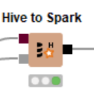
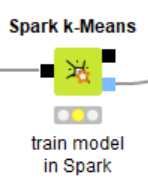
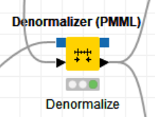
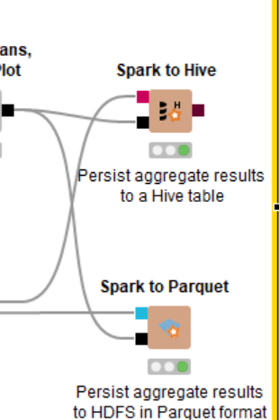

# Tugas Big Data - Local Big Data Irish Meter

Nama          : Anargya Widyadhana

NRP           : 05111740000047

Mata kuliah   : Big Data

Dataset       : `Irish Energy Meter`

## Section

Ada 6 tahapan CRISP-DM

- [Daftar File](#daftar-file)
- [Business Understanding](#business-understanding)
- [Data Understanding](#data-understanding)
- [Data Preparation](#data-preparation)
- [Modeling](#modeling)
- [Evaluation](#evaluation)
- [Deployment](#deployment)

## Daftar File

* KNIME workflow    : `Tugas_9_Big_Data_Irish_Meter_on_Spark_only.knwf`
* File dataset      : Digunakan `knime://knime.workflow/data/meters_01_50.csv`
* Deskripsi dataset : Merupakan data penggunaan listrik dalam timestamp, dan nilainya dalam satuan kW
* Sumber dataset    : Sudah ada dari KNIME

---

Dalam workflow ini, akan dijelaskan mengenai analisis yang berasal dari whitepaper "Big Data, Smart Energy, and Predictive Analytics". Akan dibuat Local Big Data Enviroment, yang akan meload dataset ke Hive, dan ditransfer ke Spark untuk dilakukan klustering. Akan menggunakan node Spark SQL untuk operasi SQL untuk menambahkan detail waktu terkait dengan data tanggal dan waktu di dataset agar diperoleh data waktu yang bervariasi. Terdapat juga metanode untuk melakukan klustering dengan k-Means dan PCA, dan menampilkan visualisasi kluster dalam grafik. Lalu, terakhir akan disimpan hasil kluster tersebut ke dalam format Hive dan Parquets

## Business Understanding

Kali ini, akan digunakan konsep Big Data, sehingga akan ada penyimpanan data menggunakan Hive, dan proses pengolahan data klustering dengan menggunakan Apache Spark, node `Spark k-Means` dan `Spark PCA`. Oleh karena itu, pertama akan dibuat sebuah environment Big Data untuk tersambung ke konteks Spark dan Hive, lalu dilakukan proses Data Preparation untuk menyiapkan data yang ada dan disimpan ke Hive. Kemudian selanjutnya dari Hive akan diload ke Spark untuk diolah. Pertama akan dibuat pemecahan data tanggal dan waktu dari dataset menjadi timeseries yang lebih lengkap, seperti pemecahan tanggal, bulan, tahun, minggu, hari dalam minggu, dsb. Dari data ini, berikutnya akan dilakukan melalui sebuah rangkaian node untuk mencari rata-rata nilai per kategori timeseries, dijoin menjadi satu tabel, baru kemudian dilakukan modeling dari data di tabel tersebut.

Pada proses modeling, data akan dinormalisasi dan dilakukan klustering dengan node `Spark PCA` dan `Spark k-Means`. Hasilnya dijoin dan didenormalisasi lagi, baru dilakukan evaluation dan deployment.
Dalam evaluation, dilakukan plotting grafik dengan node `Scatter Plot`, dan view tabel dengan node `Table View`. Pada deployment, data akan disimpan dalam format Hive dan Parquet.

## Data Understanding

* Jumlah data: 1226830
* Makna kolom:
    1. meterId: id meteran yang diukur, int
    2. enc_datetime: data tanggal bulan tahun jam menit detik dalam format int timestamp
    3. reading: jumlah kW penggunaan listrik, double

## Data Preparation

Sesuai dengan proses pada `Business Understanding`, pertama akan dibuat environment Big Data. Kita menggunakan node `Create Local Big Data Environment` seperti pada gambar di bawah.

Digunakan 2 thread.

Data yang akan kita lakukan train dan predict berasal dari `knime://knime.workflow/data/meters_01_50.csv`. Maka setelah membuat Big Data Environment, file `.csv` akan diload ke KNIME Table melalui node `File Reader`.

Selanjutnya, data diload ke Hive di dalam metanode `Load Data`.

Sebelum data diload, akan dibuat tabel di Hive dengan node `DB Table Creator` yang tersambung ke konteks Hive. Setting adalah dengan dynamic, menyesuaikan kolom pada tabel yang dijadikan input port.

Setelah tabel dibuat, barulah kita load data dari KNIME table ke Hive dengan node `DB Loader` (setting sudah secara otomatis terbuat mengikuti konteks tabel yang terhubung).

Lalu, karena di dalam modeling digunakan node dalam konteks Spark, maka di sini kita load data dari Hive ke Spark dengan node `Hive to Spark`

Lalu dilakukan proses memasukkan variasi timeseries, yang berada di metanode `Extract date-time attributes`. Pada metanode tersebut, terdapat `4` node `Spark SQL Query`, yang pertama untuk mendapat tanggal (jika di kolom menggunakan int timestamp atau format belum sesuai) dengan menambah 3 digit pertama int timestamp dengan tanggal `2008-12-31` dengan query SQL. Untuk jam dan menit, dicari dengan digit ke 4-5, dengan mengkali dengan `* 30 / 60`, diikuti `% 24` untuk jam, dan `* 30 % 60` untuk menit. Nilai jam dan menit digabung dan dipisah dengan tanda `:`.

Pada node kedua, data datetime akan dipecah menjadi kolom tanggal, bulan, tahun, minggu, dan hari dalam format string, dan jammasing-masing.

Pada node ketiga dilakukan yang lebih spesifik yaitu mengkategorikan hari berdasarkan kategori hari kerja atau hari libur dengan kode `BD` dan `WE`.

Pada node keempat dilakukan segmen hari, yaitu dengan mengkategorikan berdasarkan rentang jam, rentang `7-9`, `9-13`, `13-17`, `17-21`, `21-7`.

Berikutnya adalah proses pada metanode `Aggregations and time series`. Pada metanode ini akan ada `5` pecahan proses, untuk mencari rata-rata nilai pada kolom `Daily minimum temperatures`. Sebelumnya, karena data digunakan berkali-kali, agar cepat dilakukan caching dengan node `Persist Spark DataFrame/RDD` ke dalam memory.

Pada pecahan 1, dicari rata-rata nilai berdasarkan total, atau hanya dari id saja, dan kolom hasilnya akan direname untuk memudahkan.

Pada pecahan 2, dicari rata-rata nilai per tahun dan per id. Pertama akan dijumlah nilai berdasarkan dengan `sum` group by `id` dan `year`, lalu untuk setiap `id`, data nilai per tahun tersebut akan dirata-rata dengan `mean`. Terakhir, dilakukan rename kolom seperti tadi.

Pada pecahan 3, dicari rata-rata nilai per bulan, dengan group by bulan, tahun, id. Pertama akan dijumlah nilai berdasarkan dengan `sum` group by `id`, `month`, dan `year`, lalu untuk setiap `id`, data nilai per tahun tersebut akan dirata-rata dengan `mean`. Terakhir, dilakukan rename kolom seperti tadi.

Pada pecahan 4, dicari rata-rata nilai tiap minggu, dengan group by minggu, tahun, id. Pertama akan dijumlah nilai berdasarkan dengan `sum` group by `id`, `week`, dan `year`, lalu untuk setiap `id`, data nilai per tahun tersebut akan dirata-rata dengan `mean`. Terakhir, dilakukan rename kolom seperti tadi.

Pada pecahan 5, dicari rata-rata string hari per minggu, dengan group by year, week, dayofweek, id. Pertama akan dijumlah nilai berdasarkan dengan `sum` group by `id`, `dayofweek`, `week`, `year`. Kali ini menggunakan tabel pivot karena, nantinya ingin mendapatkan jumlah energi kW per satuan hari (Monday, Tuesday, dst.) per meterId, sehingga hasil akhirnya bisa banyak meterId yang sama lebih dari satu bersarkan harinya. Hal ini akan menimbulkan masalah saat nanti dilakukan join karena jumlah data berbeda. Oleh karena itu, dengan pivot, data hari tidak akan melebar ke bawah, tetapi ke samping dengan menambah field baru. Lalu dihitung rata-rata per harinya, dan hasil kolomnya direname seperti sebelumnya.

Pada pecahan 6, dicari rata-rata nilai tiap hari, dengan group by eventDate (tanggal lengkap), id. Pertama akan dijumlah nilai berdasarkan dengan `sum` group by `id`, `eventDate`, lalu untuk setiap `id`, data nilai per tahun tersebut akan dirata-rata dengan `mean`. Terakhir, dilakukan rename kolom seperti tadi.

Pada pecahan 7, dicari rata-rata nilai tiap segmen hari, dengan group by eventDate (tanggal lengkap), id, dan daySegment. Pertama akan dijumlah nilai berdasarkan dengan `sum` group by `id`, `eventDate`, `daySegment`, lalu dibuat pivot lagi, dan untuk setiap `id`, data nilai per tahun tersebut akan dirata-rata dengan `mean`. Terakhir, dilakukan rename kolom seperti tadi.

Pada pecahan 8, dicari rata-rata nilai tiap classifier hari, dengan group by year, month, week, id, dan dayClassifier. Pertama akan dijumlah nilai berdasarkan dengan `sum` group by `year`, `month`, `week`, `id`, `dayClassifier`, lalu dibuat pivot lagi, dan untuk setiap `id`, data nilai per tahun tersebut akan dirata-rata dengan `mean`. Terakhir, dilakukan rename kolom seperti tadi.

Pada pecahan 9, dicari rata-rata nilai tiap jam, dengan group by eventDate (tanggal lengkap), id, dan hour. Pertama akan dijumlah nilai berdasarkan dengan `sum` group by `id`, `eventDate`, `hour`, lalu dibuat pivot lagi, dan untuk setiap `id`, data nilai per tahun tersebut akan dirata-rata dengan `mean`. Terakhir, dilakukan rename kolom seperti tadi.

Berikutnya semua data pada pecahan masing-masing akan dijoin dan jadi satu tabel.

Selanjutnya, akan dicari persentase data masing-masing dayofweek terhadap minggu, masing-masing segmen hari terhadap hari, melalui `Spark SQL Query`.

Semua proses di atas jika digabungkan seperti berikut.

## Modeling

Proses modeling seluruhnya berada pada component `PCA, k-Means, Scatter Plot`. Pada proses ini, akan dilakukan training dengan metode clustering menggunakan algoritma k-means dan PCA di dalam konteks Spark, menggunakan node `Spark k-Means` dan `Spark PCA`. Akan digunakan 3 cluster (sesuai dengan jumlah kelas pada data) dan 300 kali iterasi.

Sebelumnya, data dinormalisasi dengan node `Spark Normalizer`.

Hasil dari keduanya dijoin dan diconvert menjadi KNIME Table, dan didenormalisasi kembali.

Sampai sini, data akan dipecah menjadi 2, satu dipakai di Evaluation, satunya dilanjutkan ke Deployment. Sebelum deployment, data dalam format KNIME Table akan diconvert ke Spark lagi, dan nama kolom yang ada whitespace dari hasil PCA diubah, dan dimasukkan ke component output.

Workflow Modeling keseluruhan sebagai berikut.

## Evaluation

Setelah ditrain berikutnya akan dilakukan dua proses, yaitu melakukan view data dalam plot scatter dan dalam view tabel

Hasil denormalisasi pada component `PCA, k-Means, Scatter Plot` akan diconvert sebagian kolom ke string agar warna bisa lebih bersih, dan berfokus ke visual saja.

Lalu dimasukkan ke node `Color Manager` untuk diberi warna masing-masing cluster, dan diplot dengan node `Scatter Plot`, view tabel dengan node `Table View`.

Workflow Evaluation keseluruhan dan hasilnya sebagai berikut.

## Deployment

Pada deployment, dilakukan 2 proses, insert data ke Hive dan Parquet.

Jika dilihat, keseluruhan proses Deployment adalah berikut.

