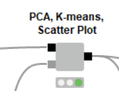

# Dataset 2

Nama          : Anargya Widyadhana

NRP           : 05111740000047

Mata kuliah   : Big Data

Dataset       : `Electricity Production`

## Section

Ada 6 tahapan CRISP-DM

- [Daftar File](#daftar-file)
- [Business Understanding](#business-understanding)
- [Data Understanding](#data-understanding)
- [Data Preparation](#data-preparation)
- [Modeling](#modeling)
- [Evaluation](#evaluation)
- [Deployment](#deployment)

## Daftar File

* KNIME workflow    : `UAS_Electricity_Production.knwf`
* File dataset  : Digunakan `Electricity_Production.csv`
* Deskripsi dataset : Merupakan data temperatur minimum per hari dimulai dari 1 Januari 1985
* Sumber dataset    : [Timeseries Dataset](https://www.kaggle.com/shenba/time-series-datasets)

---

Dalam workflow ini, akan dijelaskan mengenai analisis yang berasal dari whitepaper "Big Data, Smart Energy, and Predictive Analytics". Akan dibuat Local Big Data Enviroment, yang akan meload dataset ke Hive, dan ditransfer ke Spark untuk dilakukan klustering. Akan menggunakan node Spark SQL untuk operasi SQL untuk menambahkan detail waktu terkait dengan data tanggal dan waktu di dataset agar diperoleh data waktu yang bervariasi. Terdapat juga metanode untuk melakukan klustering dengan k-Means dan PCA, dan menampilkan visualisasi kluster dalam grafik. Lalu, terakhir akan disimpan hasil kluster tersebut ke dalam format Hive dan Parquets

## Business Understanding

Kali ini, akan digunakan konsep Big Data, sehingga akan ada penyimpanan data menggunakan Hive, dan proses pengolahan data klustering dengan menggunakan Apache Spark, node `Spark k-Means` dan `Spark PCA`. Oleh karena itu, pertama akan dibuat sebuah environment Big Data untuk tersambung ke konteks Spark dan Hive, lalu dilakukan proses Data Preparation untuk menyiapkan data yang ada dan disimpan ke Hive. Kemudian selanjutnya dari Hive akan diload ke Spark untuk diolah. Pertama akan dibuat pemecahan data tanggal dan waktu dari dataset menjadi timeseries yang lebih lengkap, seperti pemecahan tanggal, bulan, tahun, minggu, hari dalam minggu, dsb. Dari data ini, berikutnya akan dilakukan melalui sebuah rangkaian node untuk mencari rata-rata nilai per kategori timeseries, dijoin menjadi satu tabel, baru kemudian dilakukan modeling dari data di tabel tersebut.

Pada proses modeling, data akan dinormalisasi dan dilakukan klustering dengan node `Spark PCA` dan `Spark k-Means`. Hasilnya dijoin dan didenormalisasi lagi, baru dilakukan evaluation dan deployment.
Dalam evaluation, dilakukan plotting grafik dengan node `Scatter Plot`, dan view tabel dengan node `Table View`. Pada deployment, data akan disimpan dalam format Hive dan Parquet.

## Data Understanding

* Jumlah data: 397
* Makna kolom:
    1. DATE: tanggal pada setiap data dalam format `m/d/yyyy`, date menunjukkan ada 1 data setiap bulan
    2. IPG2211A2N: produksi listrik
* Semua kolom berada pada format `string`

## Data Preparation

Sesuai dengan proses pada `Business Understanding`, pertama akan dibuat environment Big Data. Kita menggunakan node `Create Local Big Data Environment` seperti pada gambar di bawah.

Digunakan 2 thread.

Data yang akan kita lakukan train dan predict berasal dari `daily-minimum-temperatures-in-me.csv`. Maka setelah membuat Big Data Environment, file `.csv` akan diload ke KNIME Table melalui node `File Reader`.

Kolom pada data masih menggunakan nama default, yang memiliki nama `DATE` yang sama seperti tipe data di SQL, dan kolom `Daily minimum temperatures` memiliki whitespaces. Maka perlu direname kolomnya dengan node `Column Rename`.

Dan karena data belum mempunyai kolom id sebagai kolom khusus bersifat unik, maka perlu ditambahkan dengan node `RowID`.

Selanjutnya, data diload ke Hive di dalam metanode `Load Data`.

Di dalam Load Data, sebelum data dimasukkan ke Hive, kolom tadi yang masih dalam format string akan diconvert, karena nantinya kita akan melakukan proses agregasi pada data. Convert dilakukan dengan node `String to Date&Time` untuk kolom `daily_date`, dan node `String to Number` untuk kolom `daily_prod`.

Sebelum data diload, akan dibuat tabel di Hive dengan node `DB Table Creator` yang tersambung ke konteks Hive. Setting adalah dengan dynamic, menyesuaikan kolom pada tabel yang dijadikan input port.

Setelah tabel dibuat, barulah kita load data dari KNIME table ke Hive dengan node `DB Loader` (setting sudah secara otomatis terbuat mengikuti konteks tabel yang terhubung).

Lalu, karena di dalam modeling digunakan node dalam konteks Spark, maka di sini kita load data dari Hive ke Spark dengan node `Hive to Spark`

Lalu dilakukan proses memasukkan variasi timeseries, yang berada di metanode `Extract date-time attributes`. Pada metanode tersebut, hanya terdapat `3` node `Spark SQL Query`, yang pertama untuk mengconvert tanggal dan waktu (jika di kolom menggunakan int timestamp atau format belum sesuai) dengan query SQL. Karena kita sudah mengganti format kolom sebelum diload di database, maka yang perlu diubah adalah kolom bertipe `datetime` pada tabel harus ditambah 1 hari, karena saat tabel diload ke Spark dari Hive, data datetime menjadi lebih cepat 1 hari dari seharusnya. Seperti berikut.

Pada node kedua, data datetime akan dipecah menjadi kolom bulan dan tahun karena data di sini hanya berjumlah 1 setiap bulannya (data bulanan).

Tidak ada node ketiga, dikarenakan tidak ada analisis hari dalam data ini.

Berikutnya adalah proses pada metanode `Aggregations and time series`. Pada metanode ini akan ada `3` pecahan proses, untuk mencari rata-rata nilai pada kolom `Daily minimum temperatures`. Sebelumnya, karena data digunakan berkali-kali, agar cepat dilakukan caching dengan node `Persist Spark DataFrame/RDD` ke dalam memory.

Pada pecahan 1, dicari rata-rata nilai berdasarkan total, atau hanya dari id saja, dan kolom hasilnya akan direname untuk memudahkan.

Pada pecahan 2, dicari rata-rata nilai per tahun dan per id. Pertama akan dijumlah nilai berdasarkan dengan `sum` group by `id` dan `year`, lalu untuk setiap `id`, data nilai per tahun tersebut akan dirata-rata dengan `mean`. Terakhir, dilakukan rename kolom seperti tadi.

Pada pecahan 3, dicari rata-rata nilai per bulan, dengan group by bulan, tahun, id. Pertama akan dijumlah nilai berdasarkan dengan `sum` group by `id`, `month`, dan `year`, lalu untuk setiap `id`, data nilai per tahun tersebut akan dirata-rata dengan `mean`. Terakhir, dilakukan rename kolom seperti tadi.

Berikutnya semua data pada pecahan masing-masing akan dijoin dan jadi satu tabel.

Semua proses di atas jika digabungkan seperti berikut.

## Modeling

Proses modeling seluruhnya berada pada component `PCA, k-Means, Scatter Plot`. Pada proses ini, akan dilakukan training dengan metode clustering menggunakan algoritma k-means dan PCA di dalam konteks Spark, menggunakan node `Spark k-Means` dan `Spark PCA`. Akan digunakan 3 cluster (sesuai dengan jumlah kelas pada data) dan 300 kali iterasi.

Sebelumnya, data dinormalisasi dengan node `Spark Normalizer`.

Hasil dari keduanya dijoin dan diconvert menjadi KNIME Table, dan didenormalisasi kembali.

Sampai sini, data akan dipecah menjadi 2, satu dipakai di Evaluation, satunya dilanjutkan ke Deployment. Sebelum deployment, data dalam format KNIME Table akan diconvert ke Spark lagi, dan nama kolom yang ada whitespace dari hasil PCA diubah, dan dimasukkan ke component output.

Workflow Modeling keseluruhan sebagai berikut.

## Evaluation

Setelah ditrain berikutnya akan dilakukan dua proses, yaitu melakukan view data dalam plot scatter dan dalam view tabel

Hasil denormalisasi pada component `PCA, k-Means, Scatter Plot` akan diconvert sebagian kolom ke string agar warna bisa lebih bersih, dan berfokus ke visual saja.

Lalu dimasukkan ke node `Color Manager` untuk diberi warna masing-masing cluster, dan diplot dengan node `Scatter Plot`, view tabel dengan node `Table View`.

Workflow Evaluation keseluruhan dan hasilnya sebagai berikut.

## Deployment

Pada deployment, dilakukan 2 proses, insert data ke Hive dan Parquet.

Jika dilihat, keseluruhan proses Deployment adalah berikut.

